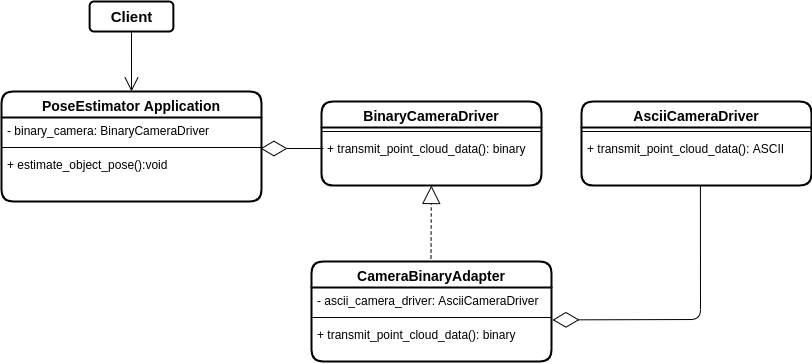

# Adapter Pattern

## Introduction
The Adapter Pattern is a Structural Pattern.

The goal of the adapter pattern is to allow objects with incompatible interfaces to collaborate.

More information and example on the Adapter Pattern can be found [here](https://refactoring.guru/design-patterns/adapter).

## A Practical Robotic Example
Imagine to be working with a vision application, in which a node calculates the estimated pose of an object by receiving point-cloud data from a camera. The point-cloud data can be represented in different formats (e.g. binary or ASCII). The pose estimation algorithm interprets the pose of an object from binary point cloud data.

During development, it might happen that we are required to integrate a new third-party library for a new better sensors. However, this sensors transmits data in ASCII format. In this case it is possible to create an adapter class, that converts the interface of one object (camera driver transmitting ASCII data) so that the other objects (pose estimator reading binary data) can understand it without changing behaviour.

## A Practical Robotic Example: UML Diagram

