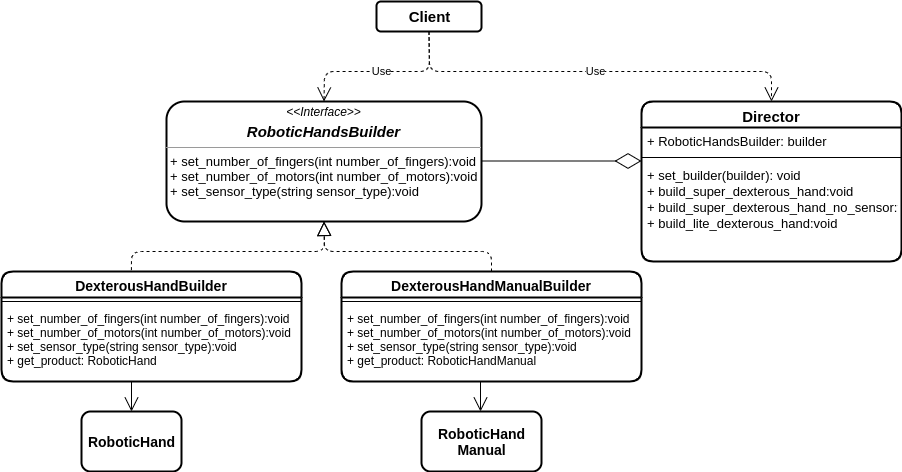

# Builder Pattern

## Introduction
The Builder pattern is a creational design pattern.

This patterns facilitates the construction of complex objects. It's based on the creation of a builder class that allows to produce different types and representation of an object using the same construction code.

When constructing complex objects it might happen that the constructor ends up having
too many parameters. This results in hard-to-read code and can lead to mistakes.

With the Builder pattern it is possible to encapsulate the construction code in common functionalities.

More information and example on the Builder Pattern can be found [here](https://refactoring.guru/design-patterns/builder).

## A Practical Robotic Example
This pattern can be really useful in allowing for flexible construction of a robotic system. Suppose to have a robotic hand. This hand can be built with different characteristics. It can have a certain numbers of fingers, a certain numbers of motors depending on the degrees of freedom required, a certain type of tactile sensors and so on.

We could construct a hand object by defining the parameters in the constructor e.g.

```
RobotHand::RobotHand(int number_of_fingers, int number_of_motors, std::string sensor_type)
```

This patterns consists in creating a Builder interface that encapsulates the construction code. For instance:

```
class RobotHandBuilder
{
  setNumberOfFingers()
  setNumberOfMotors()
  setSensorType
}
```

The concrete implementation of the builder class will construct the objects with the specific features and return the required object. We can have for instance a super dexterous hand with 5 fingers and 20 motors, and a lite hand with only 3 fingers and 10 motors. At the same time we can easily add or remove sensors.

Another advantage is that we can define a different concrete builder with the goal of writing a hand manual. Although hand and manual are two completely different objects we can use the same building interface to create them.

The director will only need to know the type of builder in order to construct correctly either the hand or the manual.

## A Practical Robotic Example: UML Diagram

