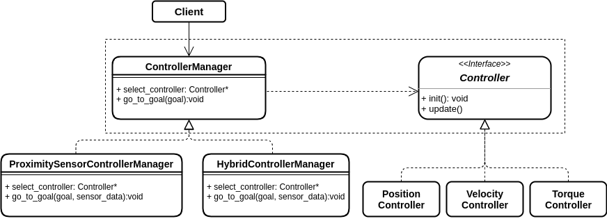

# Factory Pattern

## Introduction
The factory pattern is a creational design pattern.
Instead of directly creating objects, through the Factory Pattern we can call a special factory method which defines the type of objects to be created.
This pattern is expecially useful when we don't know which kind of object we are going to need to start with. The required objects is initialized and returned to the main client depending on the requirements. Through the Factory Pattern we have a way of encapsulating the object creation.

The advantage comes when I require some logic before instantiating a certain object. This means that the object creation depends on certain conditions. The factory pattern allows the client to dynimically request the required object without "caring" about the specific object implementation (all we know is that we need a certain type of object at a certain time).

More information and example on the Factory Pattern can be found [here](https://refactoring.guru/design-patterns/factory_method).

## Example explanation
Imagine a robotic arm operating in an unconstructed environment. This may require the robot to use different type of control depending on some sensor reading. The factory pattern can be used to create a ControllerProduct and a main application could call the required controller methodology based on the data collected from the robot.

## Example structure
