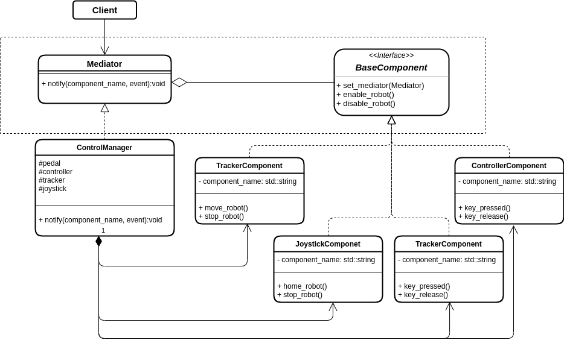

# Mediator Pattern

## Introduction
The Mediator Pattern is a behavioural design pattern.

The purpose of this pattern is to reduce chaotic dependencies between objects. It also promotes loose coupling by keeping objects from referring to each other explicitly. And lets you vary their interaction independently.

The mediator component can be seen as a manager that centralizes every action performed by a component in order to dispatch these events to all other objects that need to know information.

More information and example on the Mediator Pattern can be found [here](https://refactoring.guru/design-patterns/mediator).

## A Practical Robotic Example
The mediator pattern can be used in a huge variaty of situations. It can help having a very flexible system with various parts loosely coupled and interchangeable.
In this practical example we gonna imagine to have a telerobotic system. This system can be controller with various devices. The user can control a robot arm via a tracker placed on its wrist or via a joystick with pre-defined movements. To increase safety a pedal is provided to allow the user to decide when to start the robot, with a pedal press the robot gets enabled and it starts following the tracker's commands.
Moreover a controller is provided to the user that enables the joystick. The joystick can be used to easily home the robot.
The Mediator pattern allows to encapsulate the relationships between all these devices. Without the Mediator (which in our example is called Control Manager), all the devices should depend on each other. Moreover, the loose coupling will allow easily to switch to a different device in the future, or change the relationship among all of these.

## A Practical Robotic Example: UML Diagram

